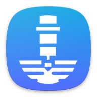

# CNC Opticut

Compute easily the best speed cutting for your CNC machine.



## TODO

- [X] Add a button to reset the settings
- [ ] Make logo available for iOS and web
- [ ] Bug: when deleting a material that is selected, the selection is
kept in the main screen

## Getting Started

This project uses the [Flutter](https://flutter.dev/) framework to build a
cross-platform mobile application (iOS and Android).

To run the application, you will need to have the Flutter SDK installed on your
machine.

1. Download and install the Flutter SDK from the [official
   website](https://flutter.dev/docs/get-started/install).
2. Install the Flutter and Dart plugins for your preferred IDE (e.g. Android
    Studio, IntelliJ, VSCode).
3. Clone this repository to your local machine.
4. Open the project in your preferred IDE and run the application through the
    IDE or by running `flutter run` in the terminal 😊

For help getting started with Flutter development, view the
[online documentation](https://flutter.dev/docs), which offers tutorials,
samples, guidance on mobile development, and a full API reference.

## Development

Main source code is located in the `lib/src` directory.
You can ignore *.g.dart files, they are generated by the build_runner
(`dart run build_runner build`).
Formula are rendered using the `flutter_math_fork` package and the LaTeX
syntax (quick syntax reference
[here](https://quickref.me/latex.html)).

## Publishing on the Play Store

We need to modify `pubspec.yaml` and increment the version number. 1.1.0+2 --> 1.2.0+3 for example.
And then run:
```bash
flutter build appbundle
```


## Localization

This project generates localized messages based on arb files found in
the `lib/src/localization` directory.

To support additional languages, please visit the tutorial on
[Internationalizing Flutter
apps](https://flutter.dev/docs/development/accessibility-and-localization/internationalization)
